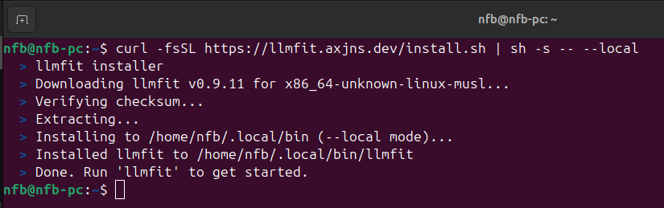

Hi! LinkedIn told me there is a repository that shows you the models (LLMs, VLMs) that better fit your GPU and PC. It is called *llmfit* (link to the repo in the resources section). Let's take a look!

## Installation

Couldn't be easier. Run on your linux terminal, no sudo required:

```
curl -fsSL https://llmfit.axjns.dev/install.sh | sh -s -- --local
```

  

Then, type `llmfit` on your terminal and that's it!

## Execution and Findings


## Takeaways

- llmfit is easy to install, run and navigate.
- Beautiful, clean CLI.
- I could not find some models, e.g. mistral-small3.2:24b or the whole Swallow LLM family from Japan.

**Thank you for reading!**

## Resources

- [llmfit GitHub](https://github.com/AlexsJones/llmfit)
- [llmfit website](https://www.llmfit.org/)

---
[Check my GitHub profile](https://github.com/nforeroba)