Hi! LinkedIn told me there is a repository that shows you the models (LLMs, VLMs) that better fit your GPU and PC. It is called *llmfit* (link to the repo in the resources section). Let's take a look!

## Installation

Couldn't be easier. Run on your linux terminal, no sudo required:

```
curl -fsSL https://llmfit.axjns.dev/install.sh | sh -s -- --local
```


Then, type `llmfit` on your terminal and that's it!

## Execution and Filtering

As soon as you run it, you find a list of 900+ models under the main hardware specs of your PC (CPU, RAM, GPU and VRAM), with 72 models hidden by *incompatible backend* though...

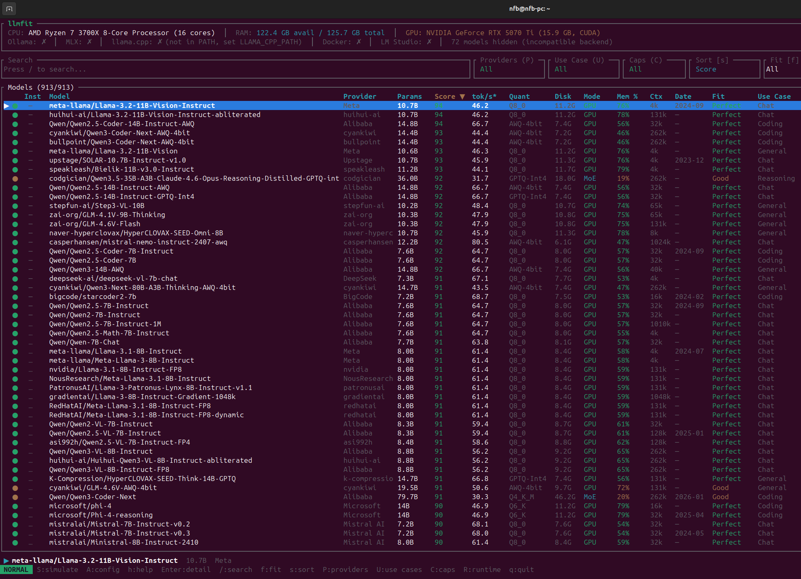

My list was comprised of 913 models, ordered by score. In addition to the name and score columns, we have: provider, number of parameters in billions, throughput in tokens per second, quantization type, size in disk, mode, memory percentage, context window, date, fit and use case. I couldn't find the models from the Swallow LLM team in Japan, finetuned for Japanese proficiency (no nitpicking intended!).

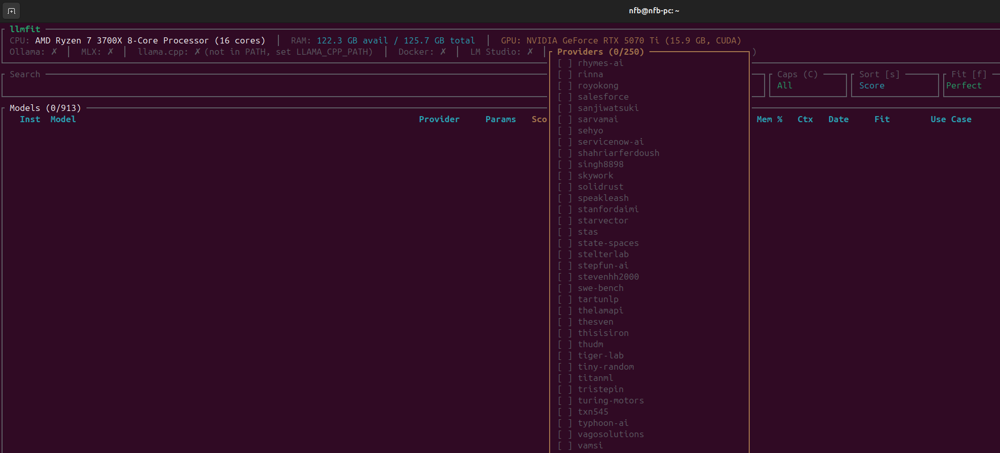

### Alibaba

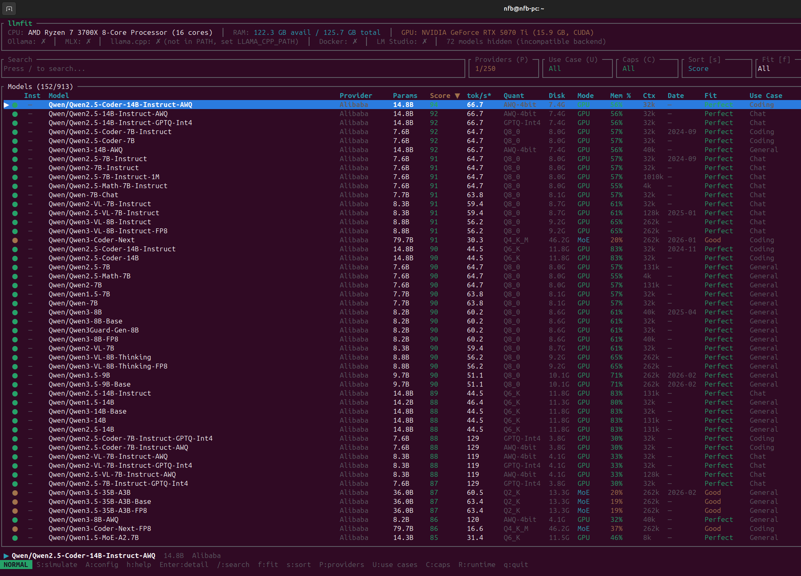

If someone is committed to the local/open-AI-model scene is Alibaba from China, with their famous Qwen models. **Qwen2.5-Coder-14B-Instruct-AWQ** scored 94 on my hardware. Could be a nice prospect for a coding agent of some sort.

### Google

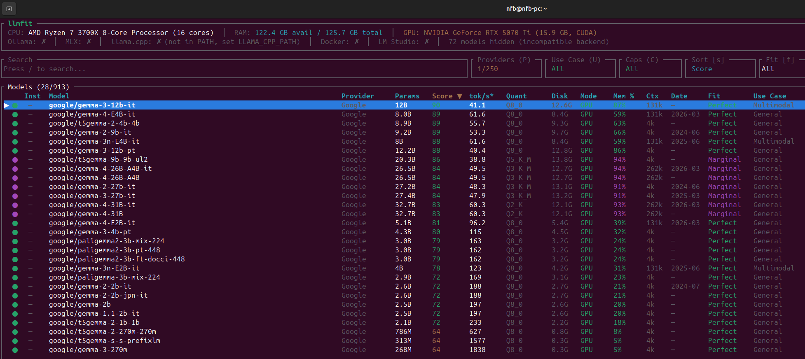

Being as renowned as the bigger sibling Gemini, the Gemma family of models is great for general and multimodal local AI. **gemma-3-12b-it** scored 90 on my hardware. I've used it before and got good results on OCR tasks, even though I got better results with Mistral-Small3.2 (not in my GPU but in a more capable RTX 5090).

### Mistral

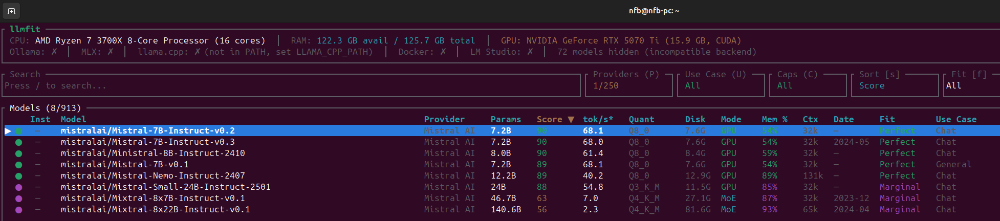

And speaking of Mistral AI... *Vive la France!* I am very fond of the Mistral models. While the spotlight is elsewhere, they have built great local models, specially in terms of text extraction from images. That's why I immediately noticed the absence of Mistral-Small3.1:24b and Mistral-Small3.2:24b on my list. However, checking the official llmfit repo, I found that might have been due to an updating problem on my end, because Mistral-Small3.1:24b is considered by the llmfit team.

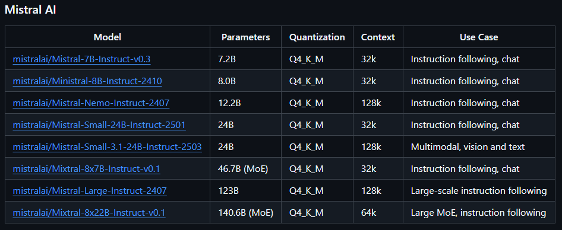

### Meta

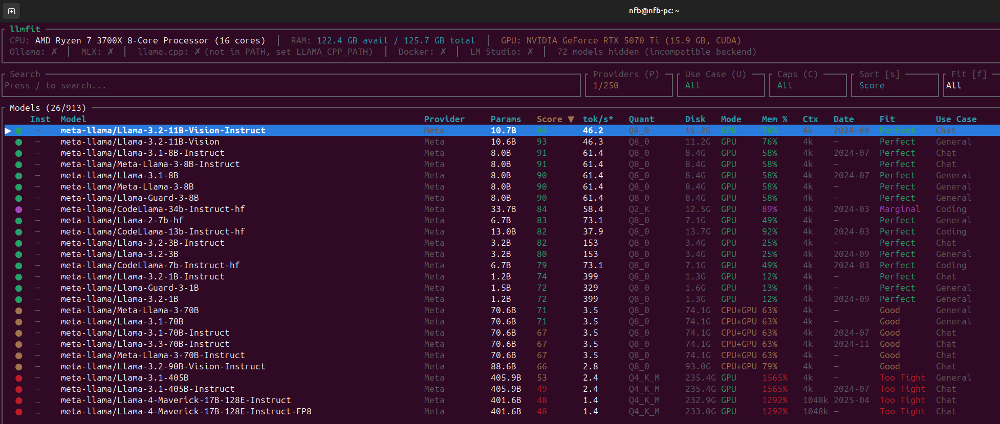

Zuck's company also has a varied model catalog, from small 1.2B to huge 405B parameter size. Surprise to no one, the 400+ billion parameter models can't run on my system. I would need two DGX Sparks to run one of those for research purposes. However, **Llama-3.2-11B-Vision-Instruct** scored 94 on my PC. I've used it in the past on a more powerful PC at work, and it had fair multimodal capabilities.

### Microsoft

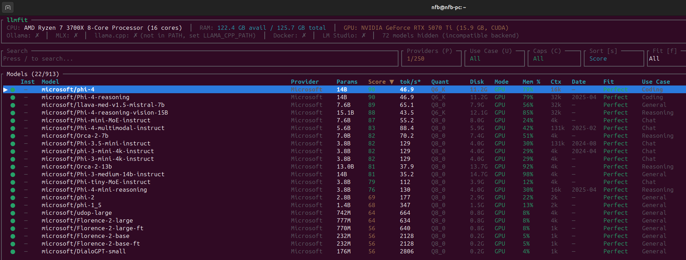

Microsoft also has interesting local models. I'm very fond of **phi-4:14b**, which scored 90 on my PC. It's meant for coding according to llmfit, but in practice it's good for chat and multi-lingual NLP too. It's a 14B powerhouse in my opinion, after using it for almost a year at work. I need to try their newer Phi-4-reasoning-vision-15B, released on March 4, 2026.

### NVIDIA

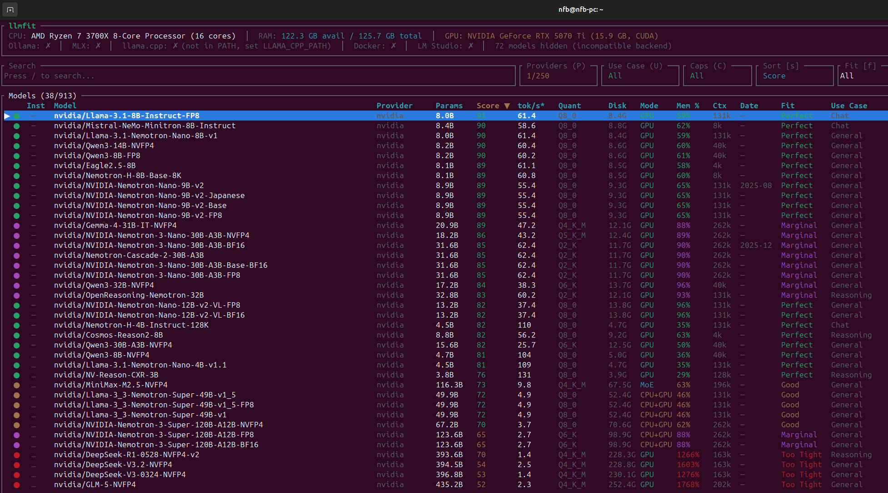

Even though I own 3 NVidia GPUs, I've never used an LLM released by them. Thanks to llmfit, I noticed a model that could be useful for my recent Japanese endeavours: **NVIDIA-Nemotron-Nano-9B-v2-Japanese**. Fits perfectly on my system, I should try it with [Niki, my 100% local Japanese AI teacher!](https://nicolasfbportfolio.netlify.app/projects/nikisensei-project/)

### OpenAI

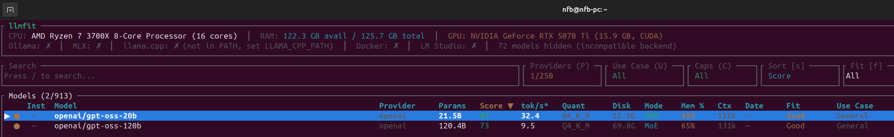

Who would have thought OpenAI is not that open. Just kidding. With only two models on the list, **gpt-oss-20b** is my best option, although the 120B variant apparently runs on my system (Mixture of Experts Mode). I know I need to take advantage of my RAM somehow, by loading some parameters there, just have to learn how.

### Perfect Fit

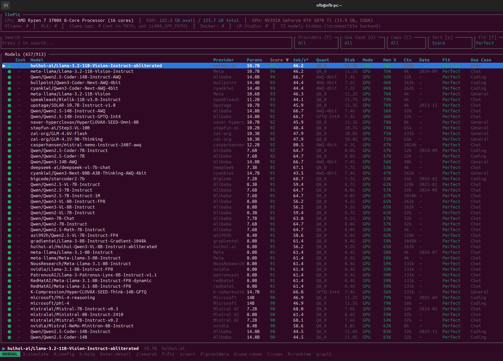

By pressing `f`, you can filter by *fit*. It turns out 657 out of 913 models fit my system perfectly. The best one comes from a provider called *huihui-ai*, their version of Llama-3.2-11B-Vision-Instruct. What might be the differences with the one made by Meta?

## Takeaways

- llmfit is easy to install, run and navigate.
- Beautiful, clean CLI.
- I could not find some models, e.g. the whole Swallow-LLM family of LLMs from Japan.

**Thank you for reading!**

## Resources

- [llmfit GitHub](https://github.com/AlexsJones/llmfit)
- [llmfit website](https://www.llmfit.org/)

---
[Check my GitHub profile](https://github.com/nforeroba)