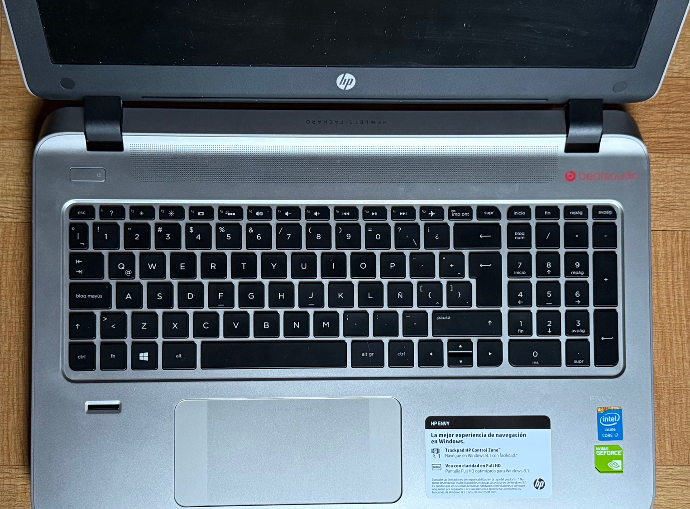

This brief blog post is about my first and current PC build. Initially meant for gaming, it has become my daily driver for coding, experimentation, development and AI. Almost 6 years after building it, it's reliable and competitive against newer hardware, specially during hardware shortages and price increases due to the AI craze.

## How It Started

Back in 2014, right in the middle of my MSc studies, I decided to buy a new computer to replace my kinda old but still functional laptop than my beloved father bought for me on 2008. I remember noticing a green sticker, it had a [NVIDIA GeForce 840M GPU](https://www.techpowerup.com/gpu-specs/geforce-840m.c2539). I never had a PC with a dedicated GPU before, so I was happy with my 863.2 GFLOPS baby.

That little GPU catalyzed something. I started to care less about the games, and more about the performance optimization of the games for my hardware. I started to tweak resolution, textures, shadows and other parameters in order to get the most frames per second (FPS) from my humble mobile hardware. I watched countless youtube videos about NVIDIA vs AMD, SLI vs Crossfire, Intel vs AMD, gigaflops, teraflops, clock speeds and so on.

## Picking Parts And Building

One of the greatest challenges was to pick compatible parts, something you don't have to worry about if you buy a console, a laptop or a pre-built PC. You have to think about sockets and architecture, expected energy consumption, power efficiency of the power supply and *future-proofing* for upgradability.  

So I read and read, watched and watched videos, until I felt confident enough (and had enough money) to build it. Between 2020 and 2021, almost 7 years after buying my 840M laptop, I got all the parts I needed to start. Waiting was worth it, because energy efficiency of CPUs and GPUs really improved between those years.  

| **Type** | **Part Name** |
|------|-----------|
| CPU | AMD Ryzen 7 3700X 3.6 GHz 8-Core Processor AM4 Socket |
| CPU Cooler | AMD Wraith Prism 2800 CFM CPU Cooler |
| Motherboard (MOBO) | Asus TUF GAMING X570-PLUS (WI-FI) ATX AM4 Motherboard |
| RAM Memory | Corsair Vengeance RGB Pro (x2) 16 GB (2 x 8 GB) DDR4-3200 CL16 Memory |
| Storage | Crucial P1 1 TB M.2-2280 PCIe 3.0 X4 NVME Solid State Drive |
| Video Card (GPU) | Asus KO GAMING OC V2 GeForce RTX 3060 Ti LHR 8 GB Video Card |
| Case | Corsair iCUE 220T RGB ATX Mid Tower Case |
| Power Supply (PSU) | Corsair TX750M Gold 750 W 80+ Gold Certified Semi-modular ATX Power Supply |  

The difference was huge. From a 0.8 TFLOP to a 17.1 TFLOP GPU, from a HDD to an SSD. Gaming performance was great, and the powerful GPU helped me with some deep learning and computer vision projects.  

The X570 was expensive back then, but it had good quality capacitors and room for upgrades.

## How It's Going

My PC is almost 6 years old, but it has never had a catastrophic failure and still rocks hard. Even though AM5 is a newer socket than AM4, due to the high prices of DDR5 RAM, AM4 is more relevant than ever.  

In the last two years I've added a PCIe 4.0 SSD and replaced the RTX 3060 Ti (8 GB) with a [RTX 5070 Ti](https://www.techpowerup.com/gpu-specs/msi-rtx-5070-ti-ventus-3x-oc-plus.b12097) (16 GB, **44.48 TFLOPS!!!**). The former GPU now belongs to the system I built for my wife, who is also into tech and software development. With two SSDs, my PC boots both windows and linux. I've also maxed out the RAM capacities of my motherboard, fortunately way before the prices increased.  

I'd like to upgrade the CPU to a 16-core 5950X or the newer 5900XT, but it can wait. First I need to assess if the PSU needs replacement before it fails at providing electricity to the system. As the experts say: "don't cheap out on the PSU".  

Considering all these things is both exciting and cumbersome and I love it. There is always room for improvement.

## Takeaways

- Do your research in order to guarantee part compatibility. YouTube is your best friend on this matter.
- Building your own system is like playing with LEGO, if you know what you are doing.
- Future-proofing is a very important variable for your consideration.

## Future Plans

Maybe you have seen that Apple Silicon is getting more and more relevant. Thanks to the ARM architecture, Apple Silicon has shown great results on AI benchmarks while being power efficient. M5 was recently released, and I might get one in the near future.

**Thank you for reading!**

## Resources

- [GPU Database](https://www.techpowerup.com/gpu-specs/)
- [PC Part Picker](https://pcpartpicker.com/)
- [Tom's Hardware](https://www.tomshardware.com/)

---
[Check my GitHub profile](https://github.com/nforeroba)