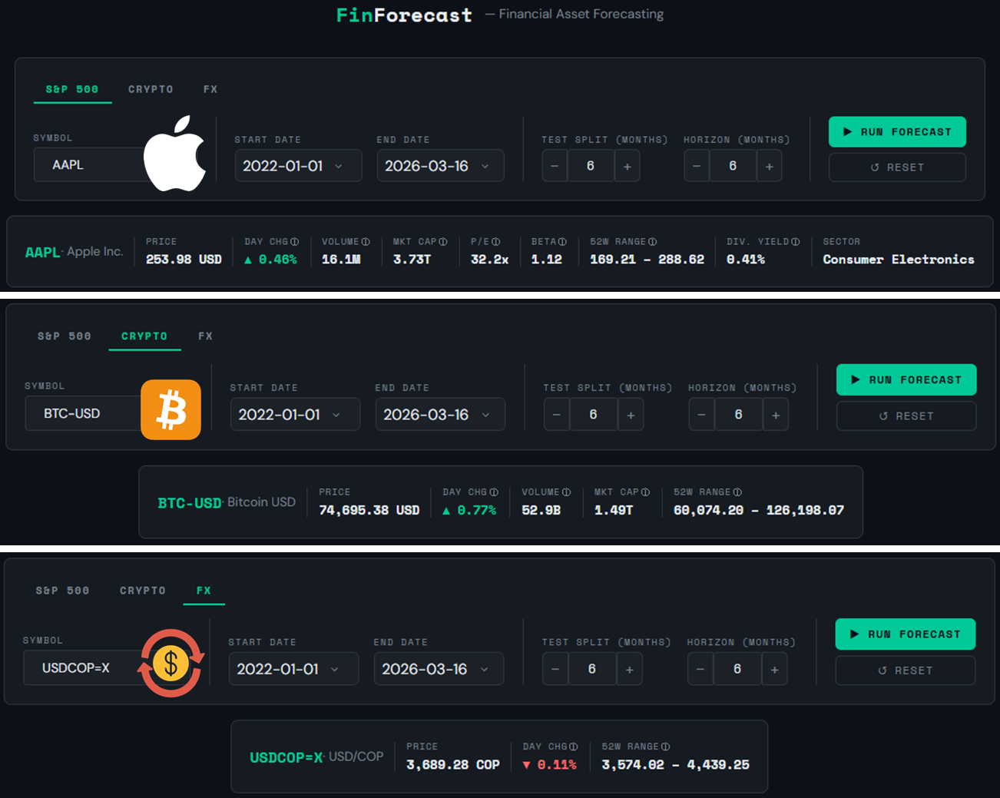
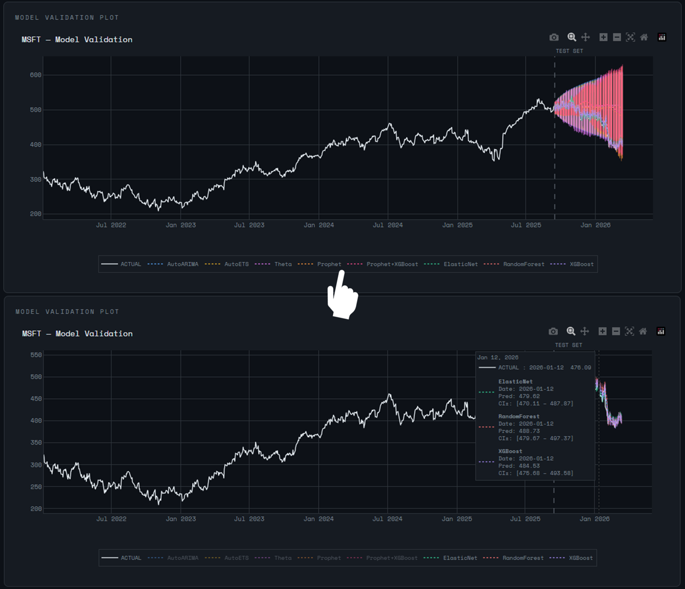
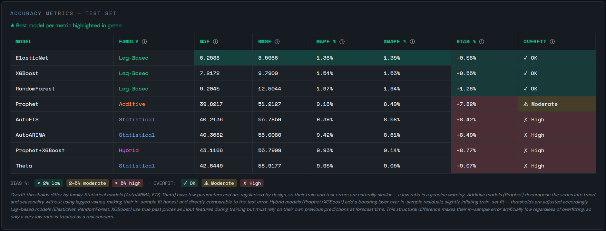
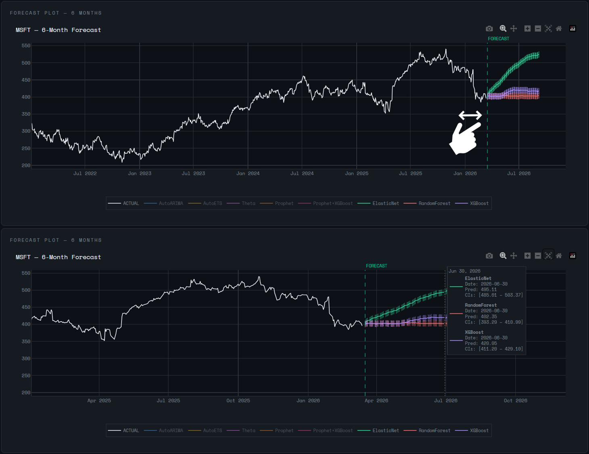

This is a financial asset forecasting application built with Python and Dash. It lets users select S&P500 stocks, top cryptocurrencies or FX (foreign exchange) pairs, configure a training window and forecast horizon, and run 8 forecasting models simultaneously. The performance of the models can be assessed by means of various metrics in order to choose the best ones for the forecast horizon plot.

## Architecture

This is a Dash app. You can see the structure of the project below:  

```
fin_fore_app/
├── app.py                     # Dash entry point
├── assets/style.css           # Theme, styles
├── src/
│   ├── data/loader.py         # yfinance + dynamic symbol loaders
│   ├── layout/
│   │   ├── components.py      # Header, control panel and symbol information card
│   │   └── plots.py           # Plotly charts (validation and forecast) + metrics table
│   ├── callbacks/
│   │   └── forecast.py        # App callbacks
│   └── models/
│       ├── orchestrator.py    # Central pipeline coordinator
│       ├── statistical.py     # AutoARIMA, AutoETS, Theta
│       ├── prophet_model.py   # Prophet + Prophet+XGBoost residues
│       └── ml_models.py       # ElasticNet, RF, XGBoost + MAPIE
```  

It is far from being a monolithic app. The functions and elements are clearly separated, useful for troubleshooting.

### Forecasting Models

| **Model** | **Family** | **Description** |
|---|---|---|
| AutoARIMA | Statistical | Auto-selects the optimal ARIMA order with drift enabled to capture linear upward trends common in financial series. Uses a season length of 5 to match the 5-day trading week. |
| AutoETS | Statistical | Automatically selects the best Error-Trend-Seasonality combination. Robust for series with clear trend and seasonal patterns. |
| Theta | Statistical | Dynamic Optimized Theta method. Decomposes the series into two lines with different slopes, effective for series with low volatility and smooth trends. |
| Prophet | Additive | Meta's forecasting model. Decomposes the series into trend, seasonality, and holiday effects. Configured with US market holidays and 90% uncertainty intervals. |
| Prophet + XGBoost residues | Hybrid | Prophet models trend and seasonality; XGBoost fits the in-sample residuals using calendar and cyclic features. Final prediction is the sum of both components. |
| ElasticNet | Lag-Based ML | Regularized linear regression (L1 + L2). Trained on lag features, rolling statistics, and Fourier terms. Confidence intervals via conformal prediction (MAPIE). |
| Random Forest | Lag-Based ML | Ensemble of decision trees. Captures non-linear relationships between lag features and future prices. Confidence intervals via conformal prediction (MAPIE). |
| XGBoost | Lag-Based ML | Gradient boosting on lag features and calendar components. Typically the strongest ML baseline for financial time series. Confidence intervals via conformal prediction (MAPIE). |  

The goal was to compare models from different families and observe their strengths and weaknesses in practice on real financial data.

## Usage

We have 3 different tabs: S&P500, Crypto and FX. Each one is populated with many symbols for you to pick, for example AAPL, BTC or USDCOP=X. In order to train the models with historical data (Yahoo! Finance), you can set the start and end dates with the date pickers. Then, you can set the test split for model validation (e.g. the last 6 months of actual data) and the forecast horizon (e.g. 6 months in the future).  

Before running the forecast, note that there is a symbol information card with useful data such as price, day change, 52W range, etc. 



Click the green button to run the forecast. It will take a minute, please allow a moment for the models to run. The app is running on a free tier space on hugging face.



The first plot you will see is the validation plot. It shows the time series of the symbol's closing price and the forecasts after the test split. Each color represents a model, but it's fair to say it is quite colorful and crowded. Fortunately, you can click one or more models in the horizontal legend under the plot in order to show or hide them. Also, you can hover along the time series to compare the predictions versus the actual data, day by day, and their confidence intervals as well.



The table shows different relevant metrics for each model (don't forget to hover on the tooltips ⓘ to learn more about technical terms):  

- **MAE:** Mean Absolute Error
- **RMSE:** Root Mean Squared Error
- **MAPE:** Mean Absolute Percentage Error
- **SMAPE:** Symmetric Mean Absolute Percentage Error
- **BIAS %:** Mean Percentage Error (MPE) — signed version of MAPE, reveals systematic over/underestimation
- **OVERFIT:** Overfitting indicator — ratio of train MAPE to test MAPE, flags models that memorize training data but fail to generalize. *Overfit thresholds differ by model family*  

The table above shows us that the first three models are suitable in terms of BIAS % and OVERFIT; they tend to overestimate (+ sign) the actual values but not by much (< 2%), and the quotient between MAPE train and MAPE test is greater than the threshold for these lag-based models (> 0.30). We will show those three models on the forecast horizon plot.



Finally, we have the forecast plot. Thanks to plotly, we can zoom in and see clearly that the first model is more bullish while the other two are more conservative. January 2026 was a tough month for MSFT stock, dropping down from 471.86 USD to 429.31 USD. The next month and a half, it has stabilized around 400 USD. The models predict it won't drop from there. We shall see...

## Conclusion

This financial forecasting app not only trains several models with financial information from relevant sectors like stocks, crypto and foreign exchange, but also tries to assess their performance by means of various metrics. In the end, we are trying to predict the future with past data in a multivariate world where a single tweet can upset the markets, so we must be conservative and keep things in perspective.  

**If you have suggestions for future improvement, please reach out!**

---

**Project Status**: ✅ Live in Production  
**GitHub**: [View Source Code](https://github.com/nforeroba/fin_fore_app)  
**Launch ▶️**: [Try it Live!](https://huggingface.co/spaces/nikoniko23/fin_fore_app)