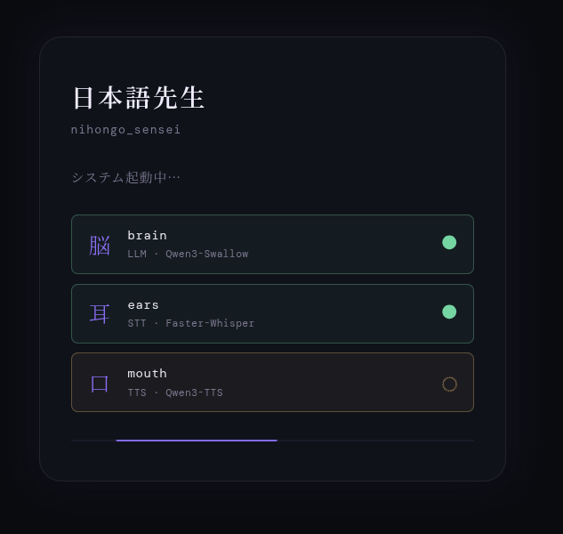
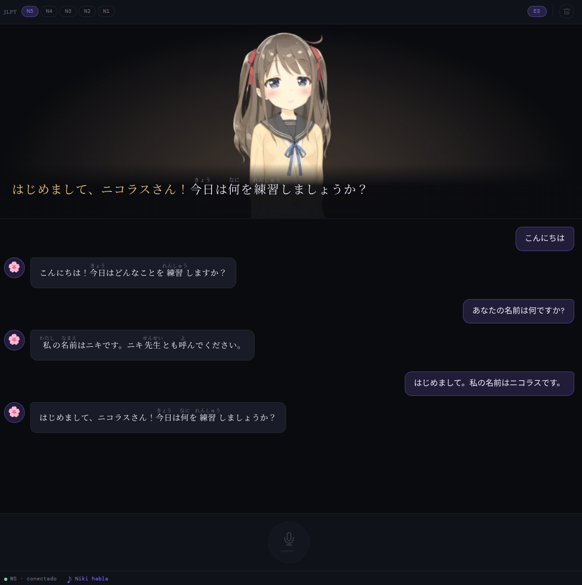
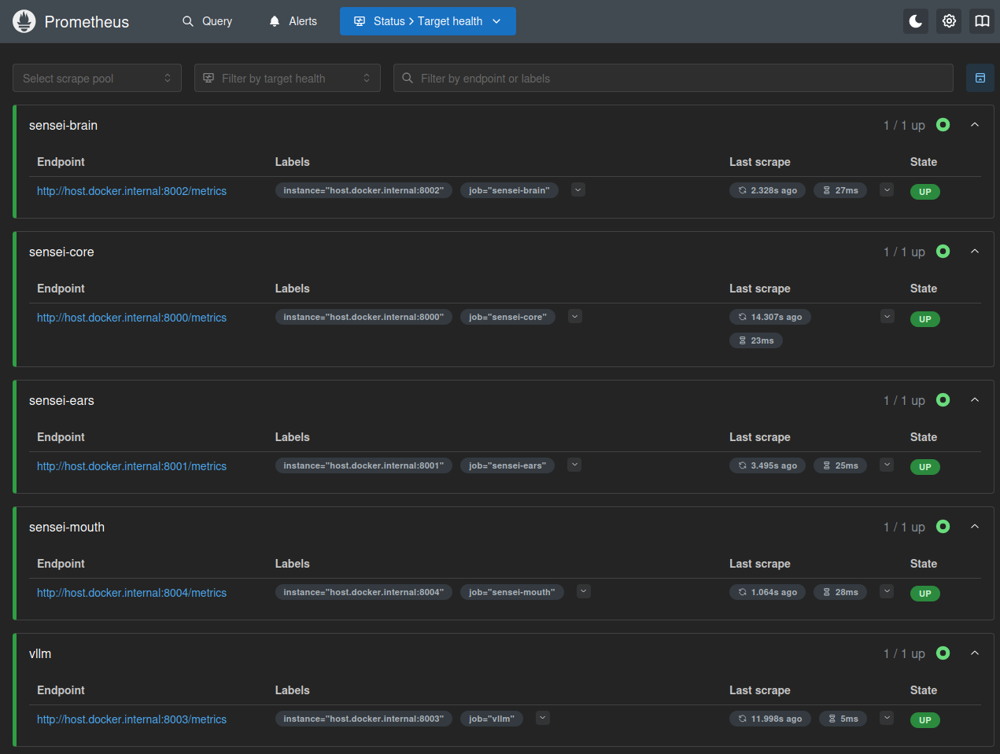
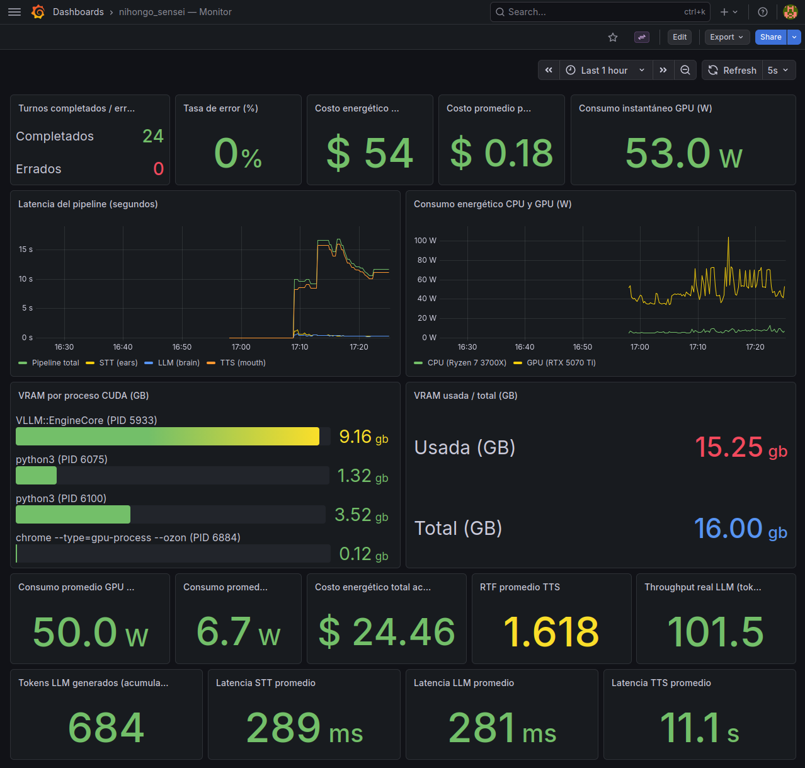

This is Niki sensei, a conversational Japanese teacher. It combines multilingual audio transcription with Faster-Whisper, a Japanese-proficient LLM with Qwen3-Swallow-8B, and natural-sounding speech synthesis with Qwen3-TTS-0.6B featuring Ono Anna's voice. On the front, an expressive Live2D avatar featuring Hiyori Momose. Behind the curtains, microservice status observability with Prometheus and a Grafana dashboard for energy, latency, and cost monitoring.

<video width="100%" controls poster="thumbnail.png">
  <source src="niki_demo_clean_audio.mp4" type="video/mp4">
</video>


## Project Architecture

You can see the structure of the project below:

```
nihongo_sensei/
├── prompts/
│   └── tutor_system.txt          ← Niki's system prompt (in Japanese)
├── services/
│   ├── shared/
│   │   └── gpu_utils.py          ← shared VRAM utility
│   ├── brain/                    ← LLM wrapper (FastAPI + vLLM)
│   │   └── main.py
│   ├── ears/                     ← STT service (Faster-Whisper)
│   │   └── main.py
│   ├── mouth/                    ← TTS service (Qwen3-TTS)
│   │   └── main.py
│   ├── core/                     ← WebSocket orchestrator (FastAPI)
│   │   └── main.py
│   └── monitor/                  ← Observability (Prometheus + Grafana)
│       ├── docker-compose.yml
│       └── prometheus.yml
└── sensei-ui/                    ← React + Vite frontend
    ├── src/
    │   ├── App.jsx
    │   ├── hooks/
    │   │   ├── useWebSocket.js
    │   │   ├── useAudioCapture.js
    │   │   └── useAudioPlayback.js
    │   └── components/
    │       ├── Avatar.jsx        ← Live2D Hiyori + expressions
    │       ├── Subtitles.jsx     ← furigana + karaoke effect
    │       ├── ChatHistory.jsx
    │       ├── Controls.jsx
    │       ├── MicButton.jsx
    │       ├── LoadingScreen.jsx
    │       └── StatusBar.jsx
    └── public/
        └── live2d/
            └── Hiyori/           ← Live2D model files
```

Each microservice can be deployed on different hardware and accessed via IP and port. Individual services can also be tested with dedicated scripts to diagnose or validate their functionality.

## Back End

The back end is composed of four Python microservices, each with its own virtual environment managed by `uv`, and a shared GPU utility module.

**sensei-ears** receives raw audio bytes from the client and transcribes them using *Faster-Whisper*, a CTranslate2-optimized reimplementation of OpenAI's Whisper by SYSTRAN. It runs the `large-v3-turbo` variant in INT8 quantization on the GPU, with VAD (voice activity detection) filtering to ignore silence. It automatically detects the spoken language, supporting Japanese, Spanish, English, etc. 

<p style="color: #ff00ff;">
<strong>Cool Fact:</strong> Faster-Whisper helps me improve my pronunciation indirectly; if I speak "carelessly", my audio is transcribed in <em>romaji (konnichiwa)</em>, meaning the threshold for Japanese language detection wasn't passed. However, if I pay more attention to my pronunciation, my audio is transcribed in <em>hiragana/katakana/kanji (こんにちは)</em>, meaning the STT detected Japanese language.
</p>

**sensei-brain** wraps a vLLM instance serving *Qwen3-Swallow-8B-AWQ-INT4*, a model developed by the Okazaki and Yokota Laboratories at Institute of Science Tokyo and AIST, built on top of Alibaba's Qwen3 base model and fine-tuned extensively on Japanese. vLLM's prefix caching reaches ~93% hit rate within a session since the system prompt stays fixed, which significantly reduces latency on consecutive turns. The service extracts an *emotion tag* from the model's response before forwarding the clean text downstream. These are the emotion tags stated in the prompt (among other useful instructions for improved user experience), which will be useful for the avatar's expressions:

<span style="color:#f6c86e">[EMOTION:happy]</span>  
<span style="color:#44da37">[EMOTION:encouraging]</span>  
<span style="color:#3eacac">[EMOTION:neutral]</span>  
<span style="color:#6957df">[EMOTION:sad]</span>  
<span style="color:#ff7bbb">[EMOTION:surprised]</span>

**sensei-mouth** synthesizes speech using *Qwen3-TTS-12Hz-0.6B-CustomVoice*, also by Alibaba, with the Ono Anna voice profile. It uses Flash Attention 2 and `torch.compile` to reduce synthesis time, and performs a three-language warm-up at startup to pre-compile the model's execution graph. However, it's still the bottleneck of the system, with an RTF of ~1.5 (should be 1.0 or less for a better experience).

The audio is returned as raw WAV bytes with synthesis time, audio duration, and RTF (real-time factor) in the response headers. **IMPORTANT:** very short texts, symbols and characters induce audio hallucinations or speech artifacts (babbling, gibberish), so prompting and regex were applied to minimize that.

## Front End

The front end is a React + Vite single-page application. It communicates with sensei-core exclusively over WebSocket, sending audio as raw binary frames and receiving JSON control messages and WAV audio in return.

The UI is organized around five components: 

- **LoadingScreen** shows the warm-up status of each service as they come online.



- **Avatar** renders Hiyori Momose, the Live2D model, using PixiJS as the WebGL renderer and pixi-live2d-display as the bridge to the Live2D Cubism SDK 5. Hiyori plays idle motions in a loop and switches between the already mentioned five expressions — happy, encouraging, neutral, sad, and surprised — driven by the emotion tag from the LLM response.

- **Subtitles** renders the furigana (the little hiragana characters above kanji) HTML with a karaoke-style progress bar synchronized to the audio duration. 



- **ChatHistory** maintains a scrollable transcript of the conversation. 

- **MicButton** is a push-to-talk button that captures audio with the MediaRecorder API and sends it as a single blob when released.

The audio pipeline uses the Web Audio API for playback, decoding the WAV buffer once to extract both the duration for subtitle sync and the audio data for playback.

## Monitoring

The observability stack runs in Docker Compose and consists of Prometheus for metric collection and Grafana for visualization. Prometheus scrapes all four services — including the vLLM engine itself — every 15 seconds via `host.docker.internal`.



The Grafana dashboard has 18 panels organized in five rows covering completed and failed turns, error rate, pipeline and per-stage latencies (STT, LLM, TTS), CPU and GPU power consumption, VRAM usage broken down by CUDA process, LLM throughput in tokens per second, TTS real-time factor, and energy cost in COP per hour and per turn.



On the RTX 5070 Ti, Qwen3-Swallow-8B AWQ-INT4 sustains >100 tokens per second on my single session and shared VRAM.

## Conclusion

Niki sensei demonstrates that a fully local, real-time conversational AI system with voice, language understanding, speech synthesis, and an animated avatar is achievable on consumer hardware — without cloud APIs, subscriptions, or data leaving your machine. The RTX 5070 Ti runs all three models simultaneously within its 16 GB VRAM budget, with roughly 1.3 GB to spare. Despite the obvious limitations of my consumer hardware, I've had a great time practicing my N5 Japanese with Niki!

## Future Plans

- **Anger expression** if the student is rude or curses, Niki gets annoyed. Requires a new `.exp3.json` expression and a system prompt rule. Although... cursing in a foreign language is fun, isn't it.
- **SQL logging** for memory and traceability.
- **Computer vision** by means of a sensei-eyes microservice, e.g. gesture detection, object detection... there are many possibilities.
- **Bubble translation on hover** — mousing over a dialogue bubble shows a translation.
- **Making my own avatars** with VROID Studio (available on Steam).

## Resources

- [Faster-Whisper](https://huggingface.co/Systran/faster-whisper-large-v3)
- [Qwen3-Swallow-8B](https://swallow-llm.github.io/qwen3-swallow.en.html)
- [Qwen3-TTS-0.6B-CustomVoice](https://qwen.ai/blog?id=qwen3tts-0115)
- [Live2D Cubism](https://www.live2d.com/en/learn/sample/)

**If you have suggestions for future improvement, please reach out!**

---

**Project Status**: ✅ Fully functional prototype. Watch the video below if you missed it!

<video width="100%" controls poster="thumbnail.png">
  <source src="niki_demo_clean_audio.mp4" type="video/mp4">
</video>